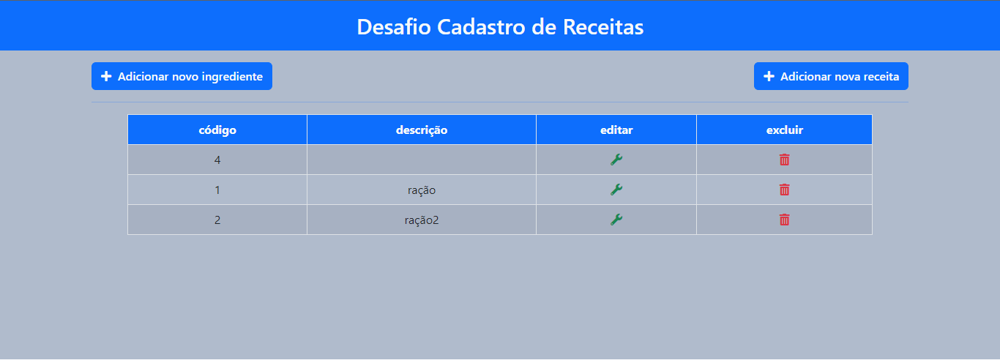

#Desafio STW

>CRUD de receitas 

## Comentários

- Ao início do projeto, eu não havia tido experiência nem com php, nem com o framework vue.js, o que me trouxe muita dificuldade

- Com ajuda de diversas fontes na internet, e de amigos, consegui entender como funcionava o que eu não sabia, e botar em prática grande parte do que foi proposto no documento

- Acredito que, com uma semana a mais, eu conseguiria terminar tranquilamente tudo o que foi pedido

- O backend com php está com os CRUDS completos, e com a conectividade com o BD estabelecida, com a presença de autenticação

- A parte que me trouxe mais dificuldade, e foi o motivo de eu não conseguir completar tudo, foi a questão de conseguir adicionar mais de um ingrediente por receita ao banco

- A estrutura do front-end está quase completa, entretanto a integração entre formulários, vue e php não está completa

- Acredito que, embora não tenha feito o programa completo, eu consegui evoluir muito durante o desenvolvimento, pois foi muito desafiador para o conhecimento que eu possuía

## Tecnologias

- HTML
- CSS
- Javascript
- Vue.js
- PHP
- SQL

## Contato

julio.schmidt@universo.univates.br